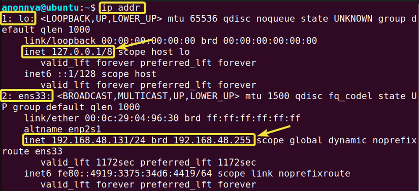
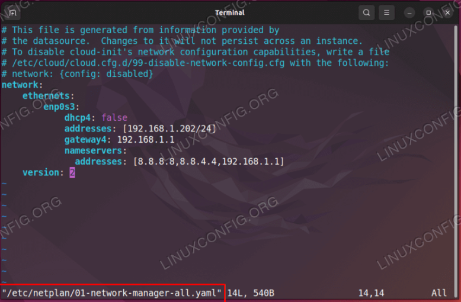

# Frankenstein (Ambiente de testes)

Frankenstein é um servidor Ubuntu com a finalidade de testar minhas aplicações, instalar vários softwares e alterar tudo o que aparecer pela frente. O melhor de tudo é que se algo der muito errado, além de não afetar o computador, é só instalar e configurar novamente.

>**MUITO IMPORTANTE:** O que não falta é material na internet abordando sobre todos os assuntos que irei dIscorrer, por isso não irei entrar em detalhes sobre a instalação da VM, do servidor e outros softwares que serão usados. A grande maioria dos recursos usados, se não todos, são escolhas particulares e podem ser facilmente substituídos por similares.

## 1. Instalando o Servidor

### 1.1 Software de Virtualização

Para que o Frankenstein não afete o seu computador de nenhuma maneira, ele será executado em uma máquina virtual (VM). Existem vários softwares de virtualização, como o [Virtual Box](https://www.virtualbox.org/), [VMware](https://www.vmware.com/) ou [Parallels](https://www.parallels.com/br). Qualquer um deles servirá para este propósito.

### 1.2 O Servidor

Não é uma exigência usar um servidor ou mesmo um servidor linux, mas vale ressaltar que todas as configurações demonstradas mais a frente serão direcionadas ao servidor [Ubuntu 24.04](https://ubuntu.com/download/server). Você também poderá usar uma máquina virtual com um SO (Sistema Operacional) linux, caso sinta falta de uma interface gráfica.

**Hardware que utilizo:**

- 2GB de RAM;
- 4 núcleos da CPU;
- 40GB de armazenamento (Devido ao armazenamento dinamicamente alocado a VM irá ocupar menos espaço que isso).

> Obs: Já consegui fazer funcionar com 1 GB de RAM e 2 núcleos, mas você sentirá a lentidão do servidor.

Caso sinta dificuldades em instalar o servidor linux recomendo consultar o canal do [Diolinux](https://www.youtube.com/@Diolinux) por ser mais lúdico, ou também o seu [blog](https://plus.diolinux.com.br/). Ou consulte quem você quiser, isso é uma recomendação e não uma ordem....

Antes de ligar o servidor recomendo acessar as configurações de rede da VM e alterá-la para modo Bridge, caso contrátio não será possível atribuir um IP fixo.

### 1.3 Primeiro Acesso

No primeiro acesso é interessante definir seu usuário com acesso administrativos e redefinir a senha do root. Normalmente o usuário criado durante a instalação do servidor já possui permissão de administrador, entretanto, por fins didáticos:

- **Criar usuário:**

``` bash
sudo adduser <nome_do_usuario>
```

- **Criar senha:**

``` bash
sudo passwd <nome_do_usuario>
```

- **Atribuir permissões ADM:**

``` bash
sudo usermod -aG sudo <nome_do_usuario>
```

- **Redefine senha root:**

``` bash
sudo passwd root
```

- Também recomendo atualizar o sistema:

``` bash
sudo apt update -y && sudo apt upgrade -y
```

## 2. Preparando o seu Computador

### 2.1 O terminal

> Se você estiver usando o Windows recomendo fortemente que use o [WSL](https://learn.microsoft.com/pt-br/windows/wsl/install), já que toda a comunicação com o servidor acontecerá via terminal (ssh).

O [zsh](https://diolinux.com.br/tecnologia/entenda-o-que-e-bash-fish-zsh.html) é um interpretador de comandos que agilizará as coisas; o Oh My ZSH é opcional também. Os vídeos do [Otávio Miranda](https://diolinux.com.br/tecnologia/entenda-o-que-e-bash-fish-zsh.html) são bem didáticos e simples, mas novamente, é uma recomendação e você poderá fazer como bem preferir.

Vamos precisar instalar o ssh, caso já não esteja, para realizar as interações com o servidor:

- ssh para Ubuntu:

``` bash
sudo apt install openssh-client openssh
```

- ssh para windows: [Consulte a Microsoft](https://learn.microsoft.com/pt-br/windows/terminal/tutorials/ssh). Caso esteja usando o WSL siga o passo a passo do Ubuntu.

Vamos aproveitar e instalar também o git:

- **instale o git (Ubuntu):**

``` bash
sudo apt install git
```

- **instale o git (Windows):**

``` bash
winget install -id Git.Git
```

### 2.2 Conexão ssh com o Github

Antes de configurar a chave ssh de conexão com o servidor vamos gerar a chave ssh para autenticar as alterações dos projetos. Gosto bastante do passo a passo do [Github](https://docs.github.com/pt/authentication/connecting-to-github-with-ssh/generating-a-new-ssh-key-and-adding-it-to-the-ssh-agent) e recomendo usar a chave sugerida id_ed25519. Na hora da validação o github vai procurar pela chave id_ed25519 e se você alterar seu nome terá problemas.

Se você estiver no Windows ou no Mac poderá usar o aplicativo do [Github Desktop](https://desktop.github.com/), mas o meu propósito é fazer o maior número de atividades pelo terminal, então prefiro usar o [GitHub CLI](https://cli.github.com/) que serve para qualquer SO.

## 3. Fazendo o Computador conversar com o Servidor

### 3.1 Definindo um IP fixo ao Servidor

Por padrão o servidor não possui um IP fixo e isso é ruim porque dependemos dele para realizar a conexaão ssh, então vamos dar um jeito nisso primeiro:

- **descobrindo o seu ip atual:**

``` bash
ip addr
```



> OBS: imagem retirada da internet.

O IP atribuído ao servidor pelo seu roteador aparecerá logo abaixo de `2: ens33:`. Anote-o em algum lugar.

Para torná-lo fixo vamos acessar a pasta `/etc/netplan` e procurar por um arquvio .yaml. Por segurança faça um backup dele:

``` bash
cp ./01-arquivo-exemplo.yaml ./01-arquivo-exemplo.yaml.bkp
```

É preciso de permissões especiais para editar o arquivo, então abrimos ele no terminal com:

``` bash
sudo nano 01-arquivo-exemplo.yaml
```

E editamos ele para ficar igual a imagem abaixo substituindo `192.168.1.202` pelo IP que anotamos:



Essa parte é bem chatinha porque a identação e a ordem dos elementos importam, pesquisar um pouco na internet pode ajudar. No meu caso usei o valor de IP também no gateway4.

Para salvar as alterações aperte `Ctrl` + `X`, `Y` e `Enter`.

O netplan só reconhecerá as alterações feitas executando:

``` bash
sudo netplan apply
```

Se aparecer uma mensagem de erro você pode debugar com:

``` bash
sudo netplan --debug apply
```

Repita o comando `ip addr` para consultar a alteração no IP.

> Também tem como fazer essa configuração via interface, se estiver usando um SO.

### 3.2 Gerando chave ssh no seu Computador

A conexão ssh com o servidor pode acontecer com a mesma chave que você usa no Github ou podemos gerar uma chave nova. Para explorar um pouco mais esse tema, criei uma chave chamada id_frankenstein:

``` bash
ssh-keygen -t ed25519
```

``` bash
Enter a file in which to save the key (/home/YOU/.ssh/id_ed25519): ~/.ssh/id_frankenstein
```

``` bash
eval "$(ssh-agent -s)"
```

``` bash
ssh-add ~/.ssh/id_frankenstein
```

OBS.: Consulte as impressões digitais que foram adicionadas com o comando `ssh-add`:

``` bash
ssh-add -l -E sha256
```

No passo 2.1 você precisou copiar a chave ssh e colar no github; aqui iremos seguir de um jeito mais simples:

``` bash
ssh-copy-id -f -i ~/.ssh/id_frankenstein.pub root@192.168.15.28
```

onde:

- `IMPORTANTE`: Enviamos ao servidor a chave pública (.pub). JAMAIS deverá enviar a chave privada

- `-i`: indica o caminho da chave ssh. Como temos duas, id_ed25519 e id_frankenstein, precisamos indicar qual será transferida ao servidor.

- `-f`: significa forçar (force). Você pode tentar executar sem ele, no meu caso precisei do f

- `root@192.168.1.202`: a chave foi enviada através do usuário root por conta de permissões. 192.168.1.202 é o IP do seu servidor

### 3.3 Configurando regras de segurança

Num servidor de produção existem regras de segurança, obviamente, que você pode configurar para estabelecer limites nas conexões ssh. O arquivo /etc/ssh/sshd_config é responsável por isso:

``` bash
sudo nano /etc/ssh/sshd_config
```

Com o atalho Ctrl+W você consegue pesquisar por palavras. Defina como `PasswordAuthentication no` para bloquear o uso de senha nas conexões ssh (você não precisará mais dela depois de realizar o passo `ssh-copy-id`) e `PermitRootLogin no` para negar conexões direto no root. Por ser uma máquina virtual você terá fácil acesso ao console e, por consequência, ao root do servidor.

Use `Ctrl` + `X`, `Y` e `Enter` para salvar as alterações.

Com isso o servidor somente ficará acessível por meio da chave ssh `id_frankenstein` ou via console. A conexão deverá ser feita indicando a chave ssh:

``` bash
ssh nome_do_usuario@192.168.1.202 -i ~/.ssh/id_frankenstein
```

> Dica: como o comando pode ser um pouco longo para quem está tendo o primeiro contato com os terminais, você pode agilizar as conexões criando um [alias](https://medium.com/@hencarlosdv/como-criar-aliases-no-linux-com-zsh-um-guia-pr%C3%A1tico-b9be512f090e).
